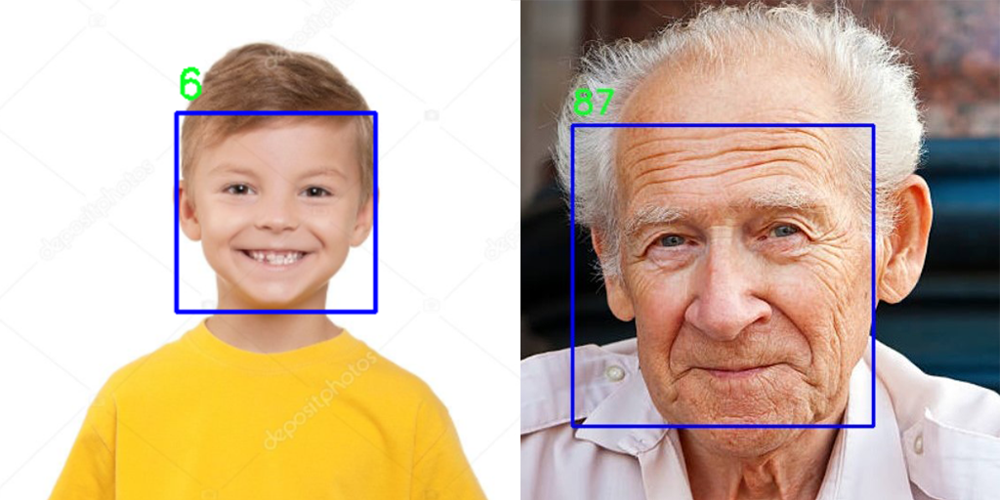

# GoslingLearning Age Recognition
Machine learning age recognition app trained on modified version of [UTKFace](https://susanqq.github.io/UTKFace/) dataset.

# Full documentation
Full **LaTeX**  documentation including information about dataset, methodology, used algorithms and case study can be found **[HERE](docs/documentation.pdf)**.

# Functions within the app
### Start Video Feed
Initiates live age prediction using the device’s camera feed. You can also resize
the video feed (the ratio of the feed is kept).
### Process Image
Analyzes an image, detects faces, and provides age predictions in new window.
### Process video
Analyzes video frames for faces, displays instant results in new window, and
saves a new video with predictions. The video is saved in the same directory as
the original with result at the end of its name.
### Process Folder with Images
Processes a folder containing images, returns a new folder with predicted ages,
and identified faces. The new folder is in the same directory as the one chosen
for the analysis.
# How to run
### Prerequisites
- Python3.10 or newer
- Pip3
### Run instructions
1. Install python package venv (if you don't have it)

    `pip3 install venv`
2. Use *venv* to create virtual environment. This allows you to install python packages only for this project. You should be in the gui directory of the project.
    
    `python3 -m venv venv`

    Then, depending on your OS and used shell:
    - MacOS or Linux:
    `source venv/bin/activate`
    - Windows with PowerShell:
    `.\venv\Scripts\Activate.ps1`
    - Windows with Command Prompt:
    `.\venv\Scripts\activate.bat`
3.  Install all the required packages:

    `pip3 install -r ./gui/requirements.txt`
4. Start the app
    `python ./gui/main_gui.py`

    *If you get an error that tkinter is not installed, then follow the guide:
https://tkdocs.com/tutorial/install.html*

5.  Deactivate venv after you're done

    `deactivate`

